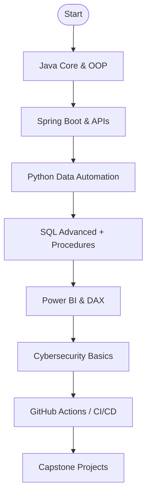

<!-- Kirby floating at the top right -->

  

<h1 align="center">Andrés Méndez</h1>

  <strong>Systems Engineering Student — 6th semester · 19 years old</strong> 
  Backend · Automation · Data Analysis

  

---

## 📫 Contact

  
  
  
  
  
  

  

  

---

## 📌 Index

- [About Me](#about-me)
- [Technologies I Use](#technologies-i-use)
- [Certifications](#certifications)
- [GitHub Stats](#github-stats)
- [Featured Projects](#featured-projects)
- [Learning Roadmap](#learning-roadmap)
- [Verified Badges](#verified-badges)

---

## 🧠 About Me

I'm a Systems Engineering student with a strong focus on **backend development**, **automation**, and **data analysis**. I build robust tools using **Python**, **Java**, and **SQL**, and work with APIs, dashboards, and automation scripts. Currently in my 6th semester, I'm actively engaged in personal projects and earning certifications to deepen my expertise.

---

## ⚙️ Technologies I Use

### 💻 Programming Languages

  
  
  
  
  
  

### 🛠️ Frameworks, Tools & Environments

  
  
  
  
  
  
  

### 🔐 Security & Networking

  
  

### 🗄️ Databases

  
  

---

<!-- Kirby waving in certifications -->

  

## 🎓 Certifications

  
  
  

---

## 📊 GitHub Stats

  
  
  

---

## 🚀 Projects

<table align="center">
<thead>
<tr>
<th>Project</th>
<th>Description</th>
<th>Status</th>
<th>Tech</th>
</tr>
</thead>
<tbody>
<tr>
<td><a href="https://github.com/AndresContreras1034/rastreador_vuelos">Cheap Flight Tracker</a></td>
<td>Automates Bogotá–Montreal flight searches, converts prices, sends alerts.</td>
<td>Completed</td>
<td>Python, SMTP, HTML, Cron</td>
</tr>
<tr>
<td>COVID-19 Dashboard</td>
<td>Interactive dashboard with filters and KPIs.</td>
<td>In Progress</td>
<td>Power BI, DAX, Open Data</td>
</tr>
<tr>
<td>Secure Password Generator</td>
<td>Tool for creating and storing encrypted passwords with GUI.</td>
<td>Prototype</td>
<td>Java, Swing</td>
</tr>
<tr>
<td>Pet Tracker</td>
<td>System for tracking pets' activity, location and health stats.</td>
<td>In Development</td>
<td>Java, SQL, JavaFX</td>
</tr>
<tr>
<td>Portfolio Analyzer</td>
<td>Tool for tracking personal investments and visualizing growth.</td>
<td>Planned</td>
<td>Python, Matplotlib, Pandas</td>
</tr>
<tr>
<td>Smart Reminder App</td>
<td>Multi-platform app that syncs deadlines, habits and notifications.</td>
<td>Planned</td>
<td>React Native, Firebase</td>
</tr>
</tbody>
</table>

  

  
   
  <em>Code. Break. Repeat.</em>

## 🎯 Learning Roadmap

---

## 🛡️ Verified Badges

  
  
  

---

<!-- GitHub Stats and Projects remain unchanged for now -->

  

  
   
  <em>Code. Break. Repeat. · Mobile-Responsive Portfolio Enabled</em>

