<!-- Kirby floating at the top right -->

  

<h1 align="center">Andrés Méndez</h1>

  <strong>Systems Engineering Student — 6th semester · 19 years old</strong> 
  Backend · Automation · Data Analysis

  

---

## 📫 Contact

  
  
  
  
  
  

  

  

---
## 📌 Index

  <a href="#about-me">About</a> •
  <a href="#technologies-i-use">Technologies</a> •
  <a href="#certifications">Certifications</a> •
  <a href="#projects">Projects</a> •
  <a href="#learning-roadmap">Roadmap</a>

## 🧠 About Me

I’m a Systems Engineering student who focuses on backend, automation, and data analysis. I like building things that work, are easy to maintain, and actually solve problems. I’m not trying to reinvent anything — just understand how it works and make it better when I can.
## ⚙️ Technologies I Use

### 💻 Programming Languages

  
  
  
  
  
  
  

### 🛠️ Frameworks, Tools & Environments

  
  
  
  
  
  
  

### 🔐 Security & Networking

  
  

### 🗄️ Databases

  
  

---

<!-- Kirby waving in certifications -->

  

## 🧰 Current Stack (2025)

- Backend: Java · Python · Spring Boot · SQL
- Frontend: HTML/CSS · JS (básico)
- DevTools: Git · VSCode · Power BI · VirtualBox
- OS: Linux (Kali/Ubuntu) · Windows

## 🎓 Certifications

  
  
  

---

## 📊 GitHub Stats

<!-- Estadísticas generales -->

 

<!-- Lenguajes más usados -->

 

<!-- Commits del año (shields.io) -->

  

<!-- Trofeos visuales -->

---

## 🚀 Projects

<table align="center">
<thead>
<tr>
<th>Project</th>
<th>Description</th>
<th>Status</th>
<th>Tech</th>
</tr>
</thead>
<tbody>
<tr>
<td><a href="https://github.com/AndresContreras1034/rastreador_vuelos">Cheap Flight Tracker</a></td>
<td>Automates Bogotá–Montreal flight searches, converts prices, sends alerts.</td>
<td>Completed</td>
<td>Python, SMTP, HTML, Cron</td>
</tr>
<tr>
<td>COVID-19 Dashboard</td>
<td>Interactive dashboard with filters and KPIs.</td>
<td>In Progress</td>
<td>Power BI, DAX, Open Data</td>
</tr>
<tr>
<td>Secure Password Generator</td>
<td>Tool for creating and storing encrypted passwords with GUI.</td>
<td>Prototype</td>
<td>Java, Swing</td>
</tr>
<tr>
<td>Pet Tracker</td>
<td>System for tracking pets' activity, location and health stats.</td>
<td>In Development</td>
<td>Java, SQL, JavaFX</td>
</tr>
<tr>
<td>Portfolio Analyzer</td>
<td>Tool for tracking personal investments and visualizing growth.</td>
<td>Planned</td>
<td>Python, Matplotlib, Pandas</td>
</tr>
<tr>
<td>Smart Reminder App</td>
<td>Multi-platform app that syncs deadlines, habits and notifications.</td>
<td>Planned</td>
<td>React Native, Firebase</td>
</tr>
</tbody>
</table>

  

## 🐍 GitHub Contribution Snake

  

## 🎯 Learning Roadmap

| Status       | Description     |
|--------------|-----------------|
| 🟢 Completed | Finished topics |
| 🟡 In Progress | Currently learning |
| 🔴 Planned   | Upcoming topics |

```mermaid
graph TD

Start([🚀 Start]) --> P0[💻 Programming Fundamentals]

subgraph Programming Skills
  P0 --> CS50[🟢 CS50x – Computer Science]
  CS50 --> Git[🟢 Git & GitHub]
  Git --> PythonFCC[🔴 Python – Data Science]
  PythonFCC --> SQL[🔴 SQL – Basic & Advanced]
  SQL --> CS50AI[🟡 CS50 – Artificial Intelligence]
  CS50AI --> CS50DS[🔴 CS50 – Data Science]
  CS50DS --> TensorFlow[🔴 TensorFlow Developer Cert.]
  TensorFlow --> RBasics[🔴 R Basics – HarvardX]
end

subgraph Tools and Data Platforms
  RBasics --> Excel[🔴 Advanced Excel]
  Excel --> PL300[🔴 PL-300 – Power BI]
  PL300 --> Databricks[🔴 Databricks Analyst]
  Databricks --> Tableau[🔴 Tableau Specialist]
end

subgraph Cloud and Architecture
  Tableau --> AZ900[🔴 AZ-900 – Azure Fundamentals]
  AZ900 --> DP900[🔴 DP-900 – Data Fundamentals]
  DP900 --> DP203[🔴 DP-203 – Data Engineering]
  DP203 --> AI102[🔴 AI-102 – Azure AI Engineer]
  AI102 --> AZ305[🔴 AZ-305 – Architect Expert]
end

subgraph Complementary Skills
  Start --> English[🟢 English B2 – Technical]
  English --> StatsDiploma[🟢 Statistics Diploma]
  StatsDiploma --> PMDiploma[🟢 Project Management Diploma]
  PMDiploma --> Scrum[🔴 Scrum Master / PMP]
end

AZ305 --> Final([🏁 Graduation & Certifications])

```

## 🐍 GitHub Contribution Snake

  

<!-- GitHub Stats and Projects remain unchanged for now -->

  

  
   
  <em>Code. Break. Repeat. ·</em>

